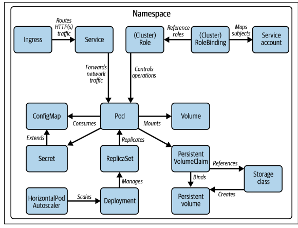
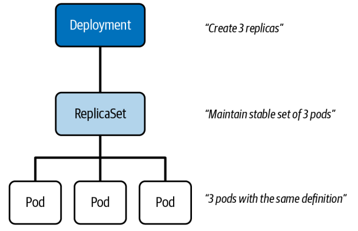

# k8s-cka
Training course for the cka certification

## First step
Go to kubespray directory and apply the README.md commands

## Kubernetes primitives


## First commands
```
alias k='kubectl'  # alias
alias ll='ls -alrt'
source <( kubectl completion bash | sed s/kubectl/k/g )
k get nodes   # Check
k api-resources # list of kubernetes resources
k get no -o wide
k describe no master
```

## Deployment
The deployment is the central kubernetes primitive used for managing your application based on microservices.  




### deployment with 3 replicas 
```shell
k create deploy -h | less
k create deployment nginx --image=nginx:1.24 --replicas=3
k get events
k get po 
k get rs
k get deploy
k get deploy,po,rs
k describe deploy # -> tab to find the object name 
k describe rs
k describe po
```
### Get yaml code source deployment 
```shell
k  get deploy nginx -o yaml >first.yaml
# copy first.yaml file and analyse
# delete lines displayed in gray color
# replace the status block of lines by status: {}
k delete deploy nginx
# k delete -f first.yaml
k create -f first.yaml
```
### Replica 
```shell
k delete po nginx-xxx 
```

## Outlines
* go to lab-pod   
* go to lab-stress  
* go to lab-resource-limit  
* go to lab-replicaset
* go to lab-labels
* go to lab-nfs
* go to lab-deployment
* go to lab-rollingupdate
* go to configmap
