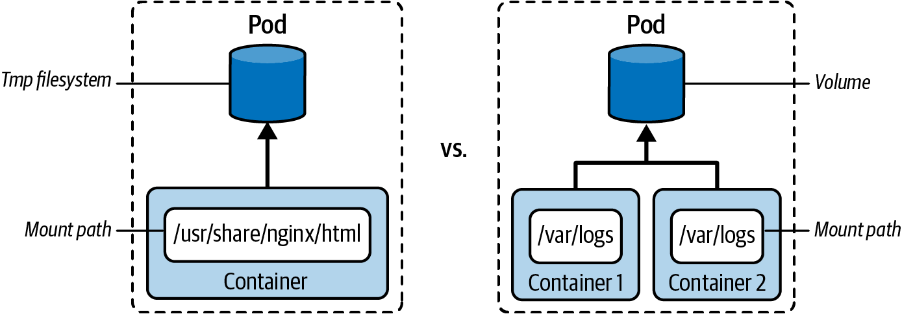
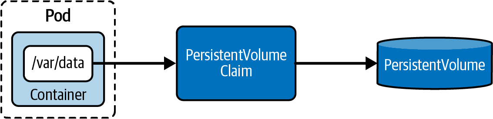
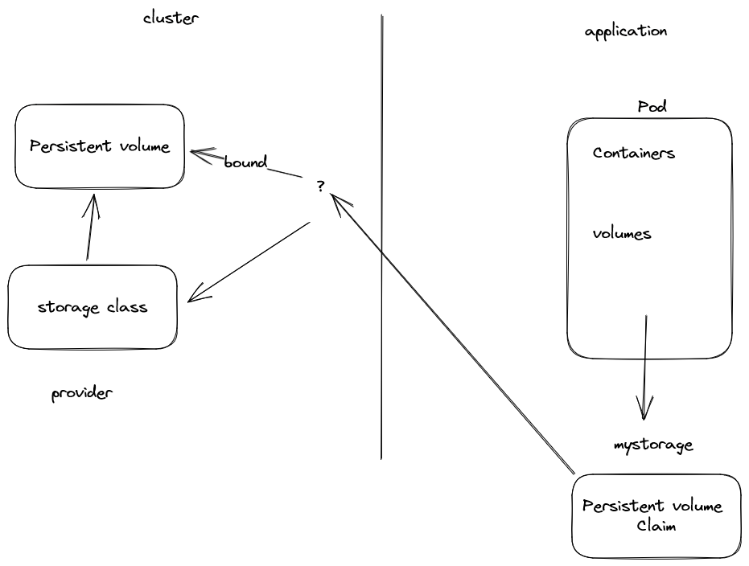

# Persistent volume

## Filesystem
Applications running in a container can use the temporary filesystem to read and
write files. In the case of a container crash or a cluster/node restart, the kubelet will
restart the container. Any data that had been written to the temporary filesystem is
lost and cannot be retrieved anymore. The container effectively starts with a clean
slate again.



## Volume 

There are many uses cases for wanting to mount a volume in a container. One of the
most prominent use cases are multi-container Pods that use a volume to exchange
data between a main application container and a sidecar. Figure above illustrates the
differences between the temporary filesystem of a container and the use of a volume.

```shell
k create -f pod-volume.yaml
k get pod business-app
k exec business-app -it -- /bin/sh
```

## Volume Type relevant to exam
* **EmptyDir**: Empty directory in Pod with read/write access. Persisted for only the lifespan of a Pod. A good choice for cache implementations or data exchange between containers of a Pod.  
* **hostPath**: File or directory from the host node’s filesystem.  
* **configMap**: secret. Provides a way to inject configuration data.   
* **nfs**: An existing Network File System (NFS) share. Preserves data after Pod restart.  
* **persistentVolumeClaim**: Claims a persistent volume.   


## NFS Share,  persistence volume and persistence volume claim

Data stored on Volumes outlive a container restart. In many applications, the data
lives far beyond the lifecycles of the applications, container, Pod, nodes, and even the
clusters themselves. Data persistence ensures the lifecycles of the data are decoupled
from the lifecycles of the cluster resources. A typical example would be data persisted
by a database. That’s the responsibility of a persistent volume. Kubernetes models
persist data with the help of two primitives: the PersistentVolume and the Persistent‐
VolumeClaim.
The PersistentVolume is the storage device in a Kubernetes cluster. It is completely
decoupled from the Pod and therefore has its own lifecycle. The object captures the
source of the storage (e.g., storage made available by a cloud provider). A Persistent‐
Volume is either provided by a Kubernetes administrator or assigned dynamically by
mapping to a storage class.
The PersistentVolumeClaim requests the resources of a PersistentVolume—for example,
the size of the storage and the access type. In the Pod, you will use the type
persistentVolumeClaim to mount the abstracted PersistentVolume by using the
PersistentVolumeClaim


### Persistent Volumes
#### Static vs. Dynamic Provisioning
A PersistentVolume can be created statically or dynamically. If you go with the
static approach, then you need to create a storage device first and reference it by
explicitly creating an object of kind PersistentVolume. The dynamic approach doesn’t
require you to create a PersistentVolume object. It will be automatically created
from the PersistentVolumeClaim by setting a storage class name using the attribute
spec.storageClassName.
A storage class is an abstraction concept that defines a class of storage device (e.g.,
storage with slow or fast performance) used for different application types. It’s the job
of a Kubernetes administrator to set up storage classes.



#### Creating PersistentVolumes
When you create a PersistentVolume object yourself, we refer to the approach as
static provisioning. A PersistentVolume can be created only by using the manifest-first
approach. At this time, kubectl doesn’t allow the creation of a PersistentVolume
using the create command. Every PersistentVolume needs to define the storage
capacity.
pv.yaml file creates a PersistentVolume named pvvol-1 with a nfs storage type with a capacity of
1Gi and read/write/many access by a single node. The attribute path mounts the
directory /opt/sfw from master host nfs share previously set up.




```shell
# Go on the master node
# BEWARE:  change the server ip address beforehand
k create -f pv.yaml   # create a persistentvolume
k get pv     # check persistentVolume
k get pvc    # check persistentVolumeClaim 
```

```shell
k create -f pvc.yaml   # create a persistentvolume
k get pvc   # Check 
k create -f nfs-pod.yaml  # install a pod connected to the pvc
k get pods    # Check 
k describe pod nginx-xxxxx  # verify  
k exec -it nginx-nfs-xxxx -- bash
```
## Resource Quota
A resource quota, defined by a ResourceQuota object, provides constraints that limit aggregate resource consumption per namespace. It can limit the quantity of objects that can be created in a namespace by type, as well as the total amount of compute resources that may be consumed by resources in that namespace.


```shell
k delete deployments.apps nginx-nfs 
k delete pvc pvc-one 
k delete pv pvvol-1 
k create namespace small
k describe ns small 
k  create -f pv.yaml 
k -n small create -f pvc.yaml 

k -n small create -f storage-quota.yaml 
k describe ns small
k -n small create -f nfs-rsquota.yaml 
k get deployments.apps -n small
k -n small describe deployments.apps nginx-nfs 
k -n small get pod
k -n small describe pod nginx-xxxx
k describe ns small

sudo dd if=/dev/zero of=/opt/sfw/bigfile bs=1M count=300
k describe ns small
du -h /opt
k -n small get deployments.apps 
k -n small delete deployments.apps nginx
k describe ns small
k -n small get pvc
k -n small delete pvc pvc-one 
k -n small get pv 
# see the status set to released
k delete pv pvvol-1 
k create -f pv.yaml 
kubectl patch pv pvvol-1 -p '{"spec":{"persistentVolumeReclaimPolicy":"Delete"}}'
# see the reclaim policy is set to Delete
k describe ns small
k -n small create -f pvc.yaml
k describe ns small
k -n small delete resourcequotas storagequota
k describe ns small
k -n small  create -f nfs-pod.yaml
```